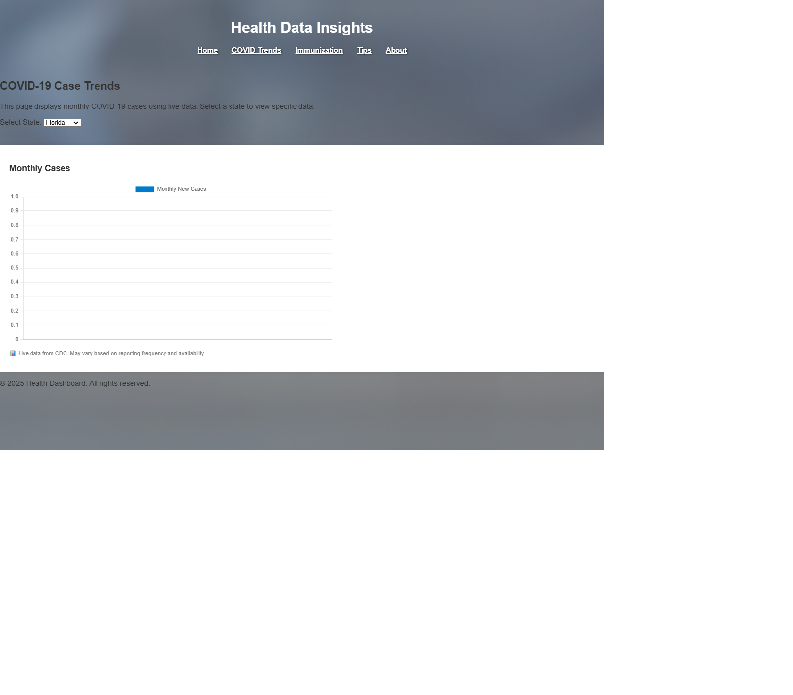
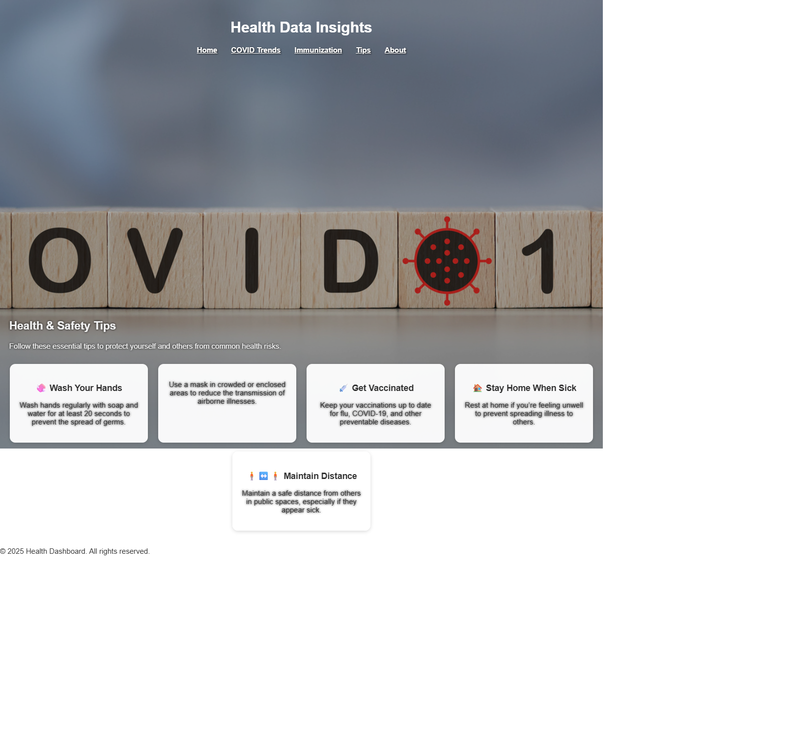
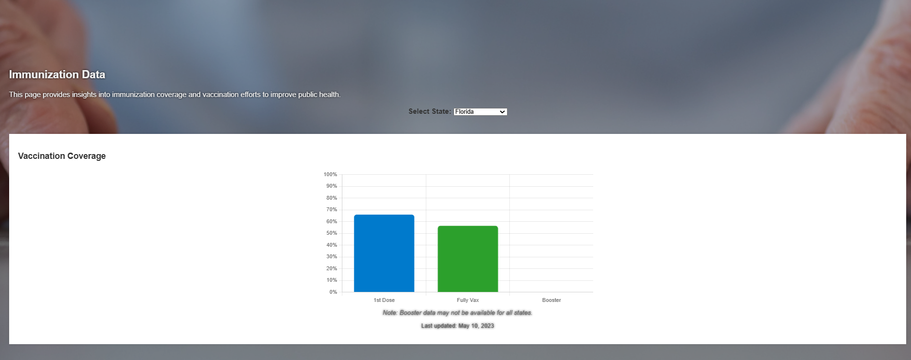
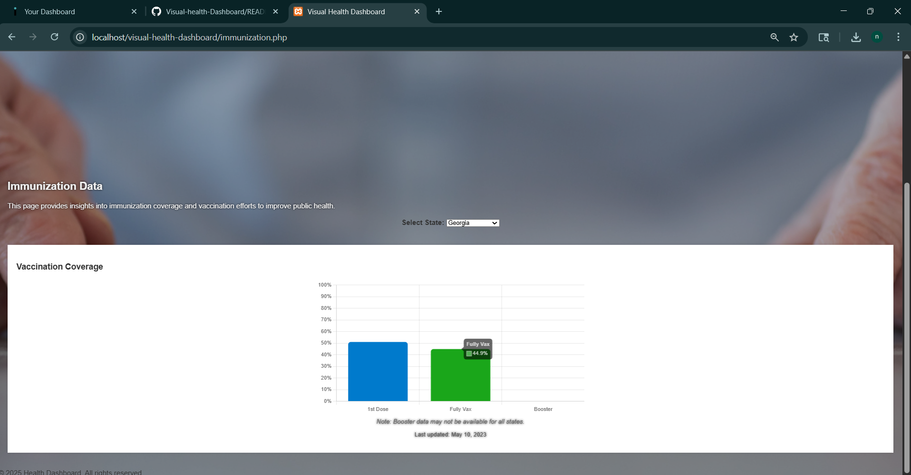
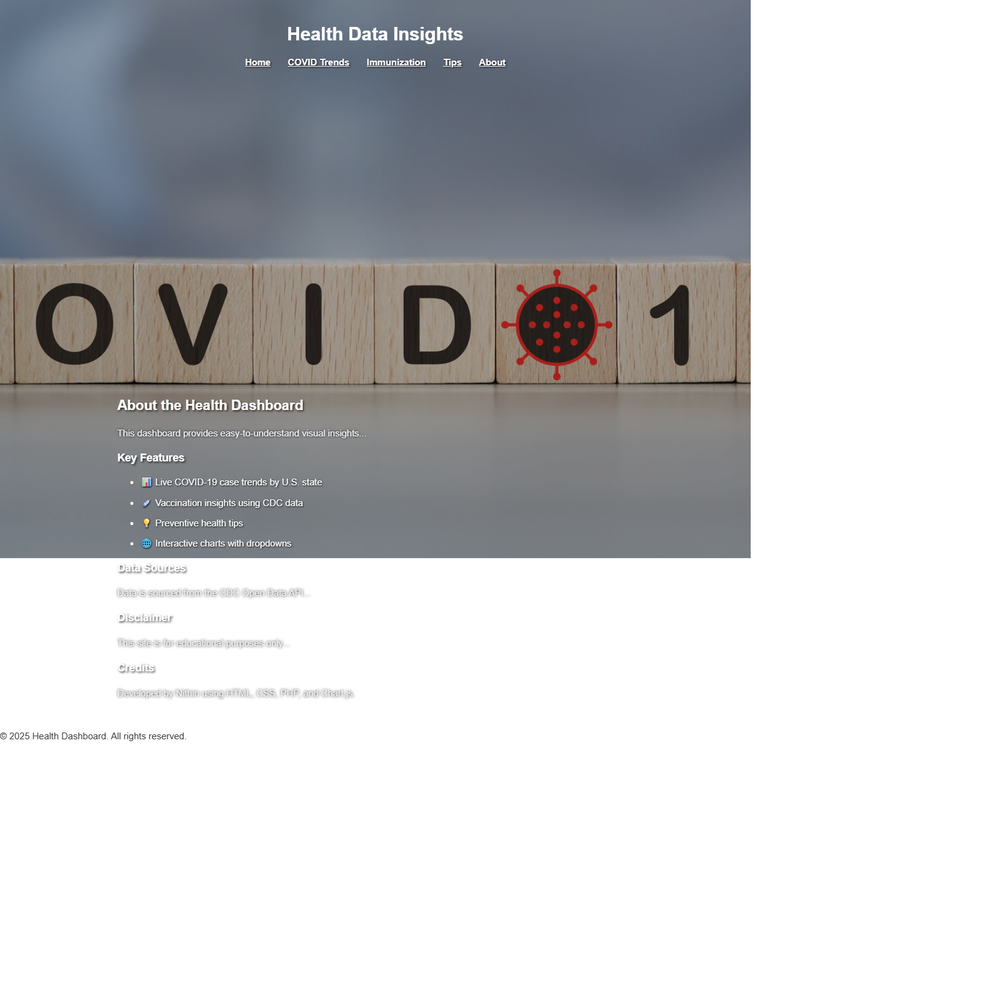

# Visual-health-Dashboard

## Project Overview

Visual Health Dashboard is a dynamic and user-centric web application designed to provide clear, interactive visualizations of health and wellness data. The dashboard consolidates important health metrics, trends, and tips into an easy-to-navigate interface, empowering users to understand and track their wellness effectively.

Built with a focus on accessibility, responsiveness, and clean design, the project combines modern web technologies to deliver engaging charts and informative content. It serves as a practical tool for individuals seeking actionable health insights in an intuitive digital format.

Key features include data-driven charts, daily wellness tips, curated health resources, and modular page components that enhance maintainability and user experience.

---

## Tools and Technologies Used

- **HTML5 & CSS3**: For semantic markup and responsive styling, ensuring accessibility and cross-device compatibility.
- **PHP**: Used for server-side scripting, modular page construction with includes, and backend form handling.
- **JavaScript**: Adds interactivity and dynamic content such as animated charts and rotating health tips.
- **XAMPP**: Provides a local Apache server and MySQL environment to run and test the PHP-based website on your machine.
- **Visual Studio Code**: The lightweight and versatile code editor used for writing, debugging, and managing the project files.
- **Browser Developer Tools (Chrome DevTools)**: Employed for real-time debugging, layout inspection, and performance testing.
- **Image Editing Tools**: Used to create and optimize graphical assets and background images used in the dashboard.

Below are website screenshots showcasing all the main pages of the Visual Health Dashboard project.

### Home Page

The Home Page serves as the welcoming entry point to the Visual Health Dashboard project. It features a clean, modern interface with a prominent header displaying the project title and navigation links to key sections such as COVID Trends, Immunization, Tips, and About.

A large background image related to COVID-19 sets the thematic context for the dashboard, while an introductory text briefly describes the purpose of the site: to present public health trends through clear visuals and helpful tips.

Below the introduction, the page provides quick-access cards or sections that highlight important health metrics, such as COVID-19 case numbers, vaccination rates, and preventive measures, encouraging users to explore data-driven insights easily.

The layout emphasizes simplicity and accessibility, ensuring users of all technical backgrounds can navigate and understand critical health information efficiently.

### COVID Trends Page

- Displays monthly COVID-19 case trends with clear, interactive visualizations.
- Includes a dropdown menu for selecting among different states (Florida, Texas, California), allowing users to view state-specific data.
- Utilizes live data from trusted sources (such as CDC) for accuracy and timely updates.
- Features a clean and accessible layout with a consistent header and footer for easy navigation.

### Health & Safety Tips Page

- Presents key public health and safety recommendations in a clear, visually engaging dashboard layout.
- Utilizes distinct cards for each tip, with relevant emojis and concise explanations to enhance readability and user understanding.
- Designed with accessibility and responsiveness in mind, ensuring information is easy to scan on all devices.
- Encourages healthy behaviors like handwashing, vaccination, mask usage, staying home when sick, and maintaining social distance.

### Immunization Data Page

  

- This page provides insights into immunization coverage and vaccination efforts across the United States, helping users understand public health progress.
- Users can select any of the 50 U.S. states from a dropdown menu to view state-specific vaccination data, with Florida and Georgia shown here as examples.
- The dashboard displays vaccination coverage statistics, including first dose, full vaccination, and booster rates, presented clearly through interactive bar charts.
- A note informs users that booster data may not be available for all states, and the data is kept up to date with timestamps for transparency.
### About Page

- The About page offers a clear overview of the Health Data Dashboard’s purpose and features, emphasizing transparency and user guidance.
- Key features are listed with icons, including live COVID-19 case trends, vaccination insights from CDC data, preventive health tips, and interactive charts.
- Data sources and disclaimers clarify the educational nature of the site and cite the CDC Open Data API as the information provider.
- The page credits the developer, reinforcing authenticity and providing contact or portfolio linkage opportunities.

## Below are explanations for all pages code

### Header.php

The `header.php` file defines the consistent header section displayed at the top of every page on the Visual Health Dashboard website.

- It begins with a semantic `<header>` tag containing the website title wrapped in an `<h1>` tag for clear branding and SEO benefits.
- Below the title, a navigation bar (`<nav>`) provides links to the main pages: Home, COVID Trends, Immunization, Tips, and About.
- The navigation links are styled for clarity and ease of use, enabling intuitive site exploration.
- Including this header via PHP `include` on each page maintains uniformity and simplifies future updates.

### Footer.php

The `footer.php` file defines the consistent footer section displayed at the bottom of every page on the Visual Health Dashboard website.

- It uses the `<footer>` semantic tag for clear structure and accessibility.
- The footer contains a copyright notice with the current year and site name.
- Its styling provides a subtle visual boundary, separating content from page end.
- Like the header, the footer is modular and included via PHP across all pages for consistent presentation and easy maintenance.
## style.css Code Explanation

The `style.css` file controls the overall visual design and layout of the Visual Health Dashboard website.

- Sets a clean base font (Arial) and resets default margins and padding for consistent layout.
- Styles the header and footer with dark backgrounds and white text to create clear framing.
- Implements a horizontal navigation menu with spaced, bold links that underline on hover for better usability.
- Defines consistent form styles with light backgrounds, borders, padding, and hover effects to improve user interaction.
- Applies distinct backgrounds, padding, and subtle shadows to special sections like tips and about for visual separation.

---

## index.php Code Explanation

The `index.php` file is the homepage of the Visual Health Dashboard website, acting as the main landing page.

- Includes common header and footer using PHP includes for consistency across pages.
- Features a welcoming hero section introducing the site’s purpose focused on health data visualization.
- Contains a dropdown menu for selecting U.S. states to dynamically view COVID-19 trends.
- Utilizes JavaScript to fetch and display interactive bar charts with monthly COVID-19 case data per selected state.
- Provides an engaging, user-friendly interface for visitors to explore public health information easily.

