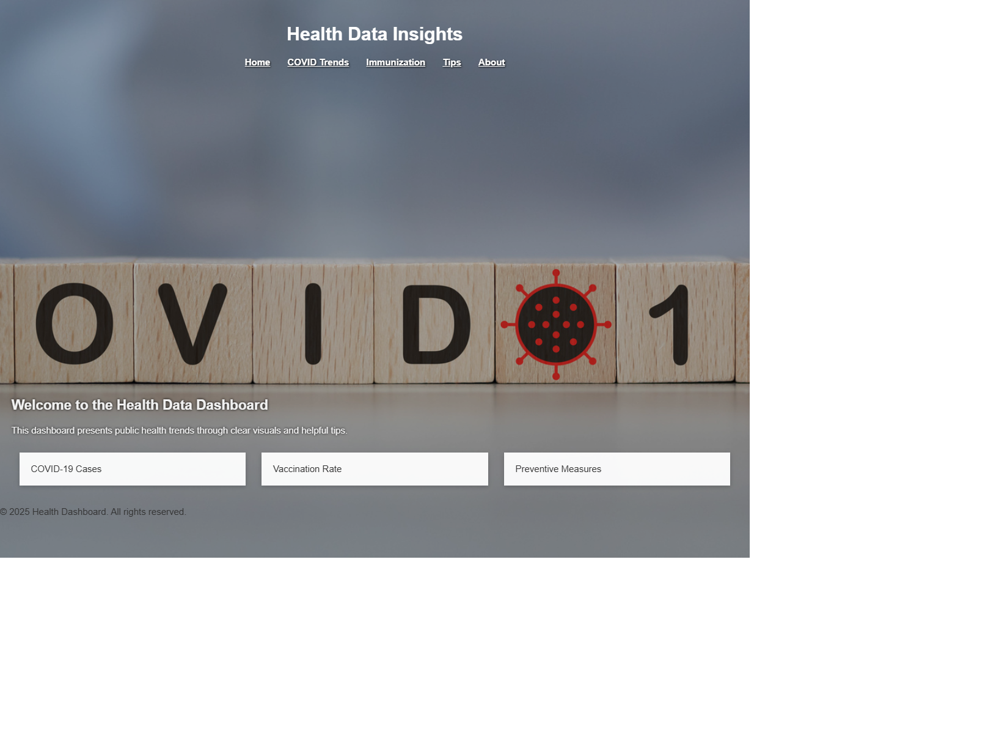

# Visual-health-Dashboard

## Project Overview

Visual Health Dashboard is a dynamic and user-centric web application designed to provide clear, interactive visualizations of health and wellness data. The dashboard consolidates important health metrics, trends, and tips into an easy-to-navigate interface, empowering users to understand and track their wellness effectively.

Built with a focus on accessibility, responsiveness, and clean design, the project combines modern web technologies to deliver engaging charts and informative content. It serves as a practical tool for individuals seeking actionable health insights in an intuitive digital format.

Key features include data-driven charts, daily wellness tips, curated health resources, and modular page components that enhance maintainability and user experience.

---

## Tools and Technologies Used

- **HTML5 & CSS3**: For semantic markup and responsive styling, ensuring accessibility and cross-device compatibility.
- **PHP**: Used for server-side scripting, modular page construction with includes, and backend form handling.
- **JavaScript**: Adds interactivity and dynamic content such as animated charts and rotating health tips.
- **XAMPP**: Provides a local Apache server and MySQL environment to run and test the PHP-based website on your machine.
- **Visual Studio Code**: The lightweight and versatile code editor used for writing, debugging, and managing the project files.
- **Browser Developer Tools (Chrome DevTools)**: Employed for real-time debugging, layout inspection, and performance testing.
- **Image Editing Tools**: Used to create and optimize graphical assets and background images used in the dashboard.

Below are website screenshots showcasing all the main pages of the Visual Health Dashboard project.

### Home Page

The Home Page serves as the welcoming entry point to the Visual Health Dashboard project. It features a clean, modern interface with a prominent header displaying the project title and navigation links to key sections such as COVID Trends, Immunization, Tips, and About.

A large background image related to COVID-19 sets the thematic context for the dashboard, while an introductory text briefly describes the purpose of the site: to present public health trends through clear visuals and helpful tips.

Below the introduction, the page provides quick-access cards or sections that highlight important health metrics, such as COVID-19 case numbers, vaccination rates, and preventive measures, encouraging users to explore data-driven insights easily.

The layout emphasizes simplicity and accessibility, ensuring users of all technical backgrounds can navigate and understand critical health information efficiently.
